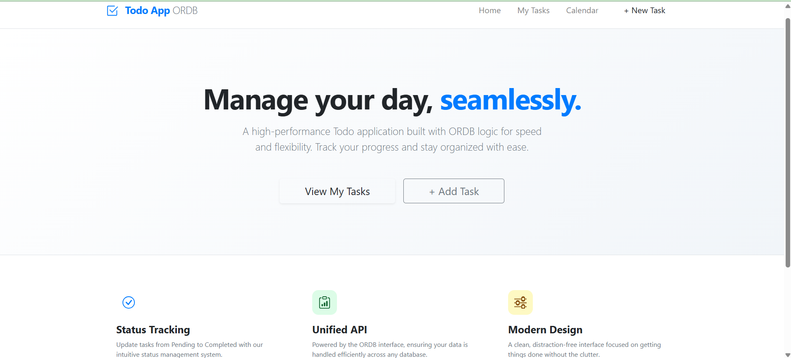
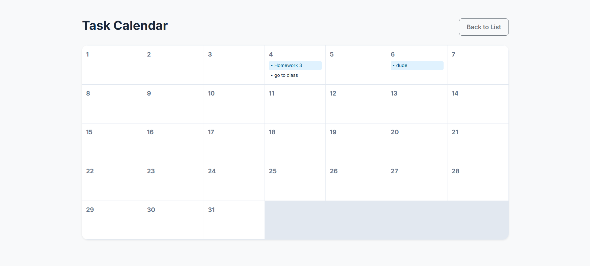
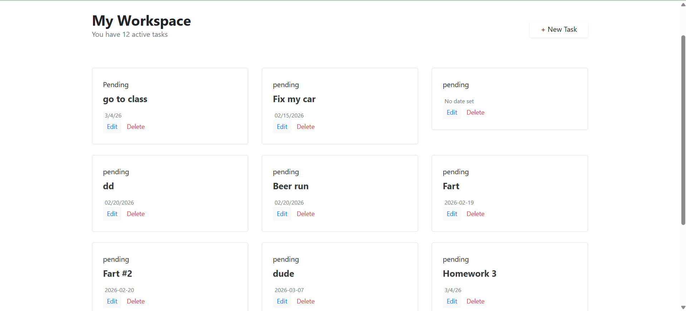

## ASE285 Team Project
### Todo App
- Team Leader: Cleyton Shelton
- Members:
   - Austin Shelton
   - Parker Groneck
   - Abdullahi Abdirahamn
  
---

## Project Metrics
-  Burndown rate: 3/6 (50%)
-  9/18 Requirements (50%)

---

## What Went Wrong

- Communication could be better and that starts with me. I think we need to have more meetings or assign the tasks better
- Merging
---

## What Went Well

- The members got their tasks done well and on time
- The members were able to pick up other features if needed 

---

## Analysis & Improvement Plan

- Better communication
- Give out tasks better
- 
---

## Week-by-Week Progress Summary

- Week 1: Setting up MongoDB, ORDB
- Week 2: Set up calendar view and mongoose
- Week 3: Set up a better list view and priorities
- Week 4: Progress tracking

---

# Sprint 2 Plan

---

### Sprint 2 Schedule (Weeks 10-14)

---

### Week 10: Sprint 2 Planning + Cleanup

Define Sprint 2 goals, acceptance criteria, and task breakdown.

Start new features and clean up features:
- Clean up Calendar
- Clean up adding tasks and progress

---

### Week 11: Dashboard Interactions

Complete dashboard interactions:
- Implement expand/collapse behavior for task blocks
- Show/hide sub-tasks inside each block
- Validate dashboard usability and data mapping

Test dashboard behavior with different task counts and statuses.

---

### Week 12: Customizable UI Themes

Implement UI theme customization:
- Add light and dark mode
- Add custom color options
- Ensure dashboard and task elements update dynamically with theme changes

Validate consistent theme behavior across all core views.

---

### Week 13: Gamification / Points System

Implement gamification features:
- Award points for task completion
- Add bonus points for early completion
- Display points and level on the user profile or main dashboard

Validate points updates through the task completion workflow.

---

### Week 14: Testing, Bug Fixes, and Sprint Wrap-Up

Run full Sprint 2 validation:
- Manual regression testing for dashboard, themes, and gamification
- Fix remaining bugs and edge cases
- Update documentation and prepare final demo notes

Finalize Sprint 2 deliverables and project handoff materials.

---

## Screenshots

### Homepage

---

### Calendar

---

### Tasks
